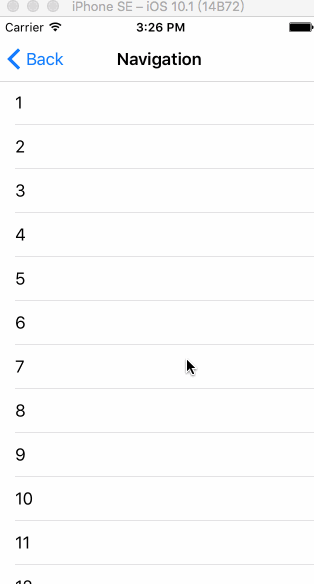
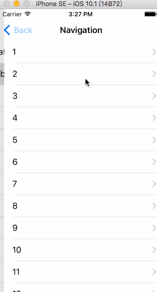
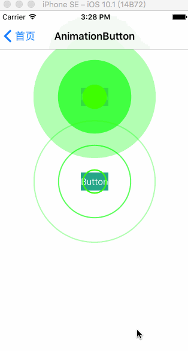
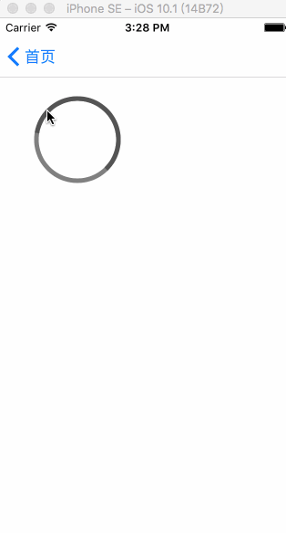
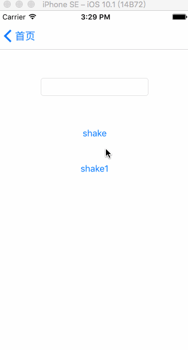
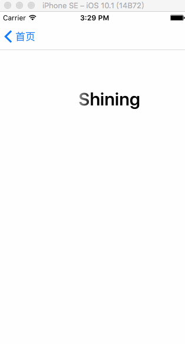
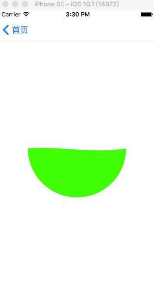
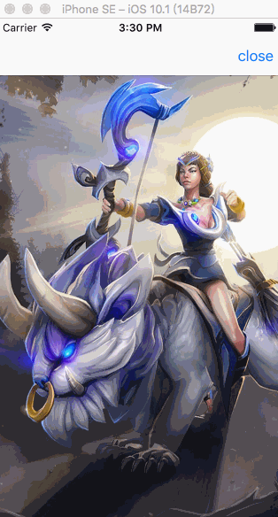

# Learning_Swift_Animation
学习swift动画    

  

##部分参考  
1 [15DaysofAnimationsinSwift](https://github.com/larrynatalicio/15DaysofAnimationsinSwift)  
2 [Yalantis](https://github.com/Yalantis)  
####持续更新~